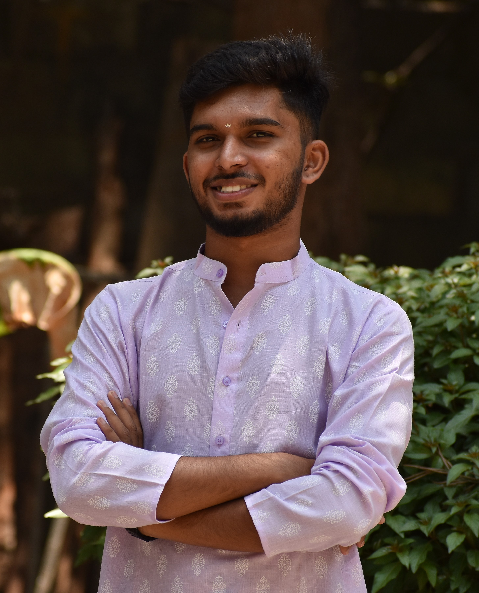

# 👋 Deepak C S

---

<table align="center" cellspacing="0" cellpadding="0">
<tr>

<td valign="middle" align="center" width="300">
  
</td>

<td valign="middle" style="padding-left: 25px;">

## 👨‍💻 About Me

Hi, I'm **Deepak C S**, an Engineering student passionate about **AI, Machine Learning, and Full Stack Development**.

- 💻 Strong interest in **Python & system design**
- 🤖 Exploring **AI, NLP, Computer Vision**
- 🚀 Building real-world projects with impact
- 🎨 Artist with attention to detail

I enjoy understanding how systems work internally and continuously improving my skills through projects and experimentation.

</td>

</tr>
</table>

---

## 🛠️ Languages & Tools

| Backend | Frontend | Database | Tools & Cloud |
|--------|---------|----------|--------------|
|   |   |   |     |

---

## 🎓 Education

- 🎓 **B.E. Information Science and Engineering**  
  CGPA: **7.92** | City Engineering College | 2026  

- 📘 PUC – 70.66%  
- 🏫 SSLC – 92.76%  

---

## 💼 Experience

### 🔹 Full Stack Intern — Edunet Foundation
- Built a **Spotify clone (MERN stack)**
- Developed backend APIs & responsive UI

### 🔹 AI Intern — Infosys Springboard
- Created **YOLO-based monitoring system**
- Implemented **automated email alerts**

---

## 🚀 Projects

### 🌱 Green Bridge
- Platform connecting **farmers & buyers**
- Crop upload, health display, buying system

### 🤖 AI Image Classification
- Real-time **object detection (YOLO)**
- Automated alert system

### 🔥 LPG Gas Leakage Detection
- IoT-based safety system  
- 🏆 2nd Prize Winner  

### 🗳️ E-Voting System
- Blockchain-based secure voting

### 🚆 Railway Management System
- DBMS-based booking & scheduling system

---

## 📊 GitHub Stats

---

## 🏆 Achievements

- ✔ Infosys Springboard Internship  
- ✔ Python Full Stack Certification  
- ✔ ML Image Classification Project  

---

## 🎯 Current Focus

- 🤖 AI Assistant + Robotics  
- 🧠 Machine Learning & NLP  
- 🌐 Full Stack Development  

---

## 🎨 Interpersonal Skills

- Creativity & Artistic Vision  
- Patience & Detail-Oriented  
- Problem Solving  

---

## 📫 Connect With Me

📧 deepakcs2k4@gmail.com  

---

### ⚡ *Artist by passion, Engineer by profession* 🎨

### 🐍 Contribution Snake

